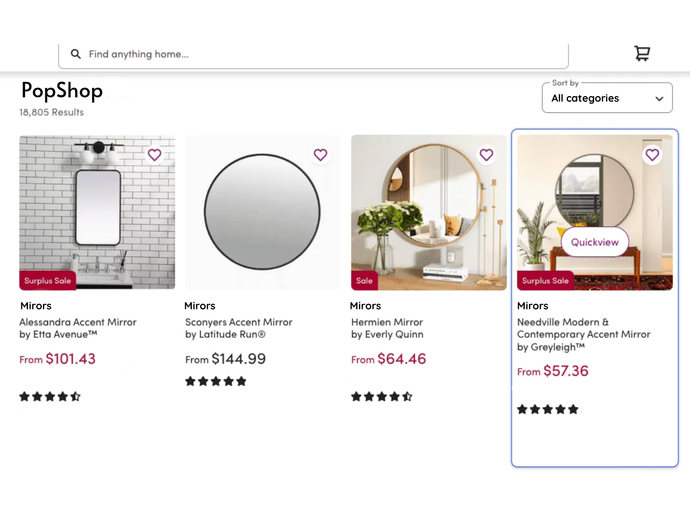

# PopShop - E-commerce Web Application

PopShop is a simple e-commerce web application developed as a home assignment for Myndlift. It allows users to browse products fetched from an external API ([https://fakestoreapi.com/products](https://fakestoreapi.com/products)), search for products by title, sort by category, view product details in a modal.

## Features

- Search bar for filtering products by title.
- Sort products by category.
- Display product details: title, price, category, image, and rating.
- Modal popup for viewing detailed product description and count.

## Technologies Used

- HTML, CSS, JavaScript (React)
- External API: [https://fakestoreapi.com/products](https://fakestoreapi.com/products)

## Installation

1. Clone the repository:

1. Navigate to the project directory:
1. ```cd
   cd PopShop
   ```
1. Install dependencies:
   ```npm
   npm install
   ```
1. Start the development server:
   ```npm
   npm run dev
   ```
1. Open your browser and visit `http://localhost:5173` to view the application.

## Usage

- Browse products: Scroll through the list of products displayed on the homepage.
- Search products: Use the search bar to filter products by title.
- Sort by category: Select a category from the dropdown menu to sort products.
- View product details: Click on a product to view its detailed description in a modal.

## Mockup

Mockup image can be found


## Deployed Application

The application is deployed on Netlify. You can access it [here](https://popshopweb.netlify.app/).

## Credits

This project was developed by Saleh Kalouti for the Myndlift home assignment.
